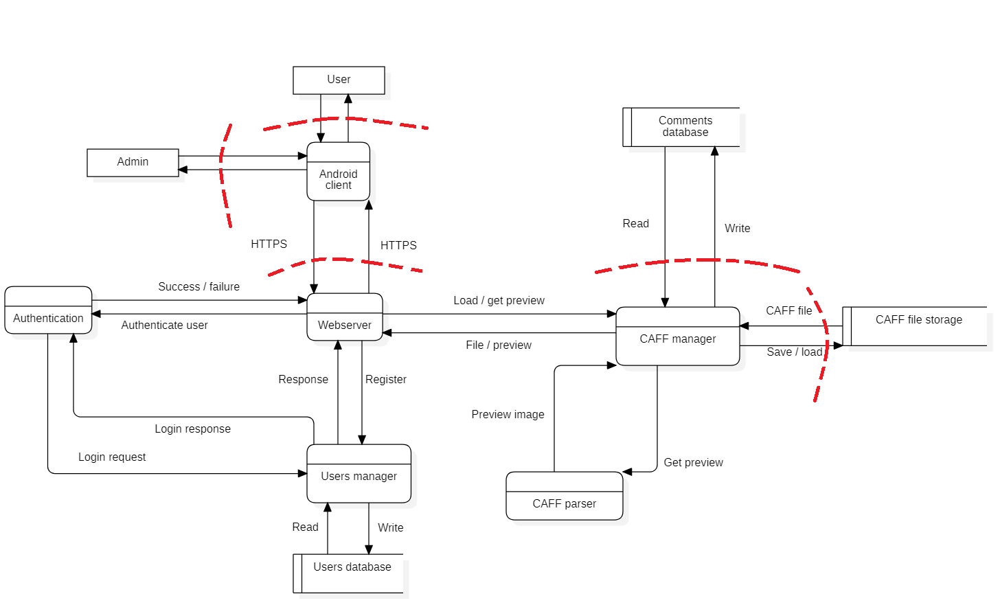
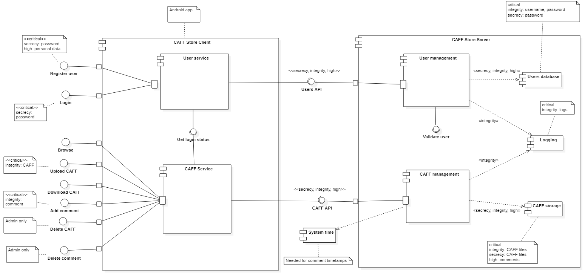

# Szamitogep Biztonság HF Specifikáció
## Követelmények
### Funkcionális követelmények
A projekt célja egy olyan online áruházat elkészítése, amiben egyedi formátumú animált képeket lehet vásárolni. A legfontosabb követelmények és felhasználási szenáriók a kevetkezők:
* A szoftvernek a CAFF (CrySyS Animated File Format) formátumot kell támogatnia.
* A felhasználóknak kell tudni regisztrálni és belépni.
* A felhasználóknak kell tudni CAFF fájlt feltölteni, letölteni, keresni.
* A felhasználóknak kell tudni CAFF fájlhoz megjegyzést hozzáfűzni.
* A felhasználóknak keresés közben meg kell tudni tekinteni a CAFF fájl előnézetét.
* Az adminisztrátoroknak tudniuk kell kommenteket törölni.
* Az adminisztrátoroknak tudniuk kell CAFF képeket törölni.

A funkcionális követelményeket az alábbi use-case diagramm foglalja össze:

### Technológiai követelmények
A szoftverrel szembeni technológiai követelmények a következők:
* A backend szolgáltatásnak távolról, HTTPS protokollon elérhetőnek kell lennie, egy REST Api-n keresztül.
* A CAFF feldolgozással kapcsolatos részeket hatékony módon, C++ nyelven kell implementálni.
* A kliens oldalt mobilos vagy webes kliens formájában kell implementálni. A kliens implementációjára az Android platformot és a Kotlin nyelvet választottuk.

### Biztonsági követelmények és célok
Mivel a kliensektől és a hálózaton érkező esettleges egyéb kéréseket nem tudjuk kontrollálni, ezért a velük történő interakció bizalmi kérdéseket vet fel. A regisztrációhoz és bejelentkezéshez felhasználói adatok tárolására van szükség, amelyek bizalmas információnak számítanak. Az alkalmazásba feltöltött CAFF képek értéket képviselnek, így megfelelő védelmükről gondoskodni kell. A képekhez fűzött kommentek személyes adatokat tartalmazhatnak, melyeket csak a bejelentkezett felhasználók láthatnak, így ezek hozzáférésvédelméről is gondoskodni kell. A Caff Store és környezetének kapcsolatát az alábbi ábra mutatja be:

A biztonsági követelményeket 6 kategóriába soroljuk:
* Confidentiality
    * Csak a bejelentkezett felhasználók láthatják a rendszerben lévő CAFF képek listáját.
    * Csak a bejelentkezett felhasználók láthatják a kommenteket.
    * A felhasználók nem láthatják más felhasználók adatait, és azt, hogy ki melyik képet vásárolta meg.
* Integrity
    * A felhasználók nem módosíthatják más felhasználók adatait.
    * A felhasználók nem módosíthatják a mások által írt kommenteket.
    * A felhasználók nem módosíthatják a mások által feltöltött képeket.
* Availability
    * A felhasználók csak bejelentkezés után láthatják a megvásárolható képek listáját.
    * Az általuk megvásárolt képeket a felhasználók bármikor letölthetik.
* Authentication
    * A felhasználók csak bejelentkezés után férnek hozzá a webshop tartalmához.
    * A felhasználókat egyedi felhasználónevükkel azonosítjuk.
* Authorization
    * A bejelentkezéshez a felhasználók jelszót használnak.
    * Az alkalmazásban szerepköröket különböztetünk meg, melyek a sima felhasználó és az adminisztrátor.
* Auditing
    * A felhasználói tevékenységet naplózni kell.
    * Naplózzuk a regisztrációkat, a bejelentkezéseket a képfeltöltéseket, vásárlásokat és kommenteket.
    * A naplónak visszakereshetőnek kell lennie, és tartalmát egyik felhasználó se módosíthassa.

## Threat assessment
### Assetek azonosítása
Fizikai assetek:
* Mobiltelefonok a kliens oldalon
* Szerver gépek
* Adatbázisok
Emberi assetek:
* Felhasználók
* Üzemeltetők, adminisztrátorok
Logikai assetek:
* Felhasználói adatok (köztük a felhasználónév és jelszó)
* A feltöltött CAFF képek
* A képekhez fűzött kommentek
* A vásárlások
* Log fájlok

A felhasználók több use-case-ben is kapcsolatba lépnek a rendszerrel: képeket böngészhetnek, kommentelhetnek mások képeihez, vásárolhatnak és saját képeket tölthetnek fel az áruházba. Ezen műveletekhez azonban csak regisztráció és bejelentkezés után férhetnek hozzá. Az adminisztrátorok a normál felhasználói jogosultságokon kívül törölhetnek képeket és kommenteket is. Az alkalmazásban nincs lehetőség adminisztrátorként regisztrálni, az adminisztrátorok az adatbázisban előre rögzítettek.

A rendszer komponenseit és azok kapcsolatait az alábbi adatfolyam-diagramm mutatja be:

### Támadó modell kidolgozása
A lehetséges veszélyforrások rendszerezéséhez a STRIDE keretrendszert használtuk, melynek elemei a következők:

Veszélyforrás | Példa 
------------ | -------------
Megszemélyesítés | Egy felhasználó valaki más által megvásárolt képet akar letölteni.
Hamisítás | Valaki jogtalanul módosítja egy másik felhasználó CAFF képét.
Tevékenység letagadása | Egy felhasználó megpróbálja letagadni az általa írt kommentet. 
Információ szivárgás | Egy felhasználó megszerzi egy másik felhasználó jelszavát. Egy felhasználó vásárlás nélkül jut hozzá egy képhez. 
Szolgáltatás megtagadás | Egy felhasználó olyan sok képet akar letölteni, hogy összeomlik a rendszer.
Jogosultsági szint emelése | Egy normál felhasználó illetéktelenül adminisztrátori jogokhoz jut.

## Architektúra tervek
### A rendszer architektúrája

### A rendszer viselkedése
A rendszerrel történő legfontosabb interakciókat az alábbi sekvencia-diagrammok ábrázolják:

### Regisztráció

### Kép vásárlása

### Komment hozzáadása

### Kép törlése

